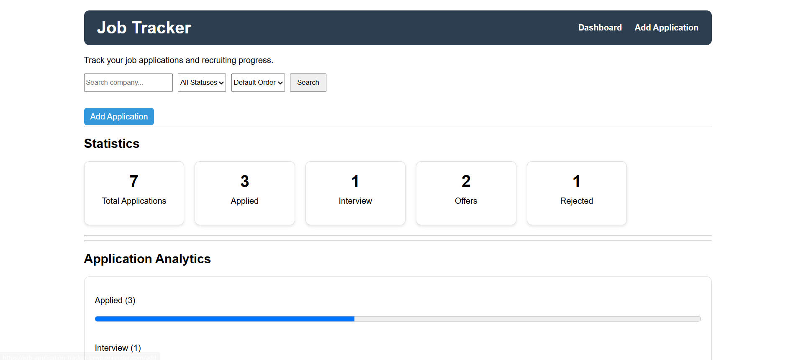
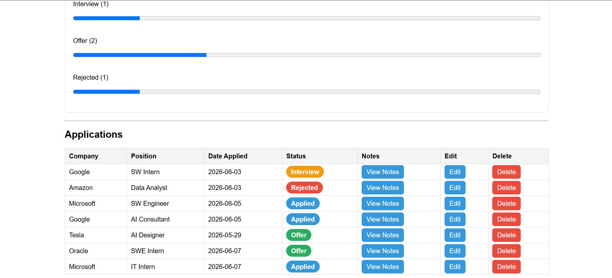
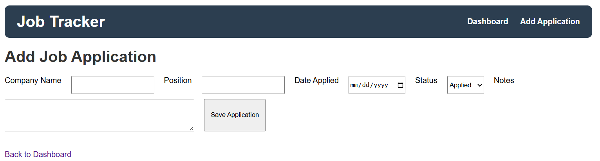
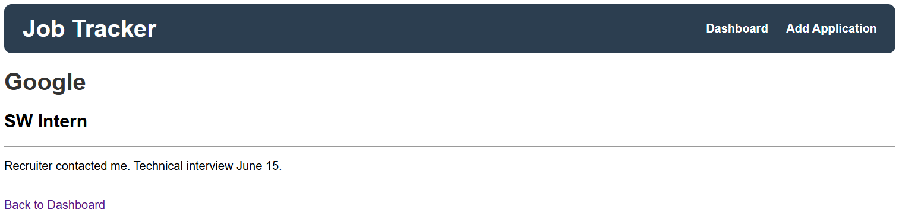

# Job Application Tracker

Live Demo: https://job-application-tracker-brwp.onrender.com

A full-stack web application that helps users track job applications, interview stages, offers, rejections, and recruiting progress. The application provides a centralized dashboard for managing job searches and visualizing application statistics.

## Features

* Add new job applications
* View all applications in a dashboard
* Update application status
* Delete applications
* Add and manage recruiter/interview notes
* Search applications by company name
* Filter applications by status
* Sort applications by application date
* Dashboard statistics
* Application analytics and progress tracking
* JavaScript delete confirmation
* Responsive navigation system

## Technologies Used

### Backend

* Python
* Flask
* SQLite

### Frontend

* HTML
* CSS
* JavaScript
* Jinja2 Templates

### Deployment

* GitHub
* Render

## Screenshots

### Dashboard




### Add Application



### Notes Page



## Installation

Clone the repository:

```bash
git clone https://github.com/YOUR_USERNAME/Job-Application-Tracker.git
```

Navigate to the project folder:

```bash
cd Job-Application-Tracker
```

Install dependencies:

```bash
pip install -r requirements.txt
```

Run the application:

```bash
python3 app.py
```

Open:

```text
http://127.0.0.1:5000
```

## Future Improvements

* User authentication
* CSV export
* Email follow-up reminders
* Advanced analytics charts
* Dark mode
* Company contact management

## What I Learned

Through this project I gained experience with:

* Full-stack web development
* Flask routing and request handling
* SQLite database management
* CRUD operations
* Search, filtering, and sorting functionality
* HTML, CSS, and JavaScript integration
* Deploying web applications using Render
* Git and GitHub workflow
